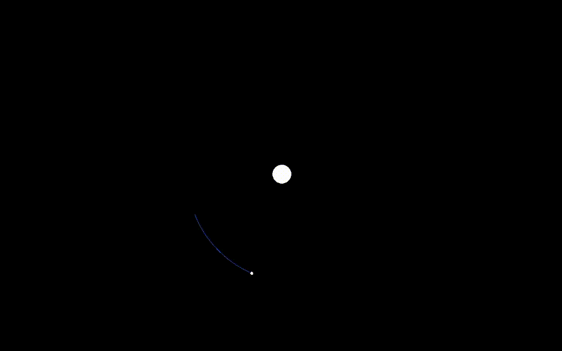
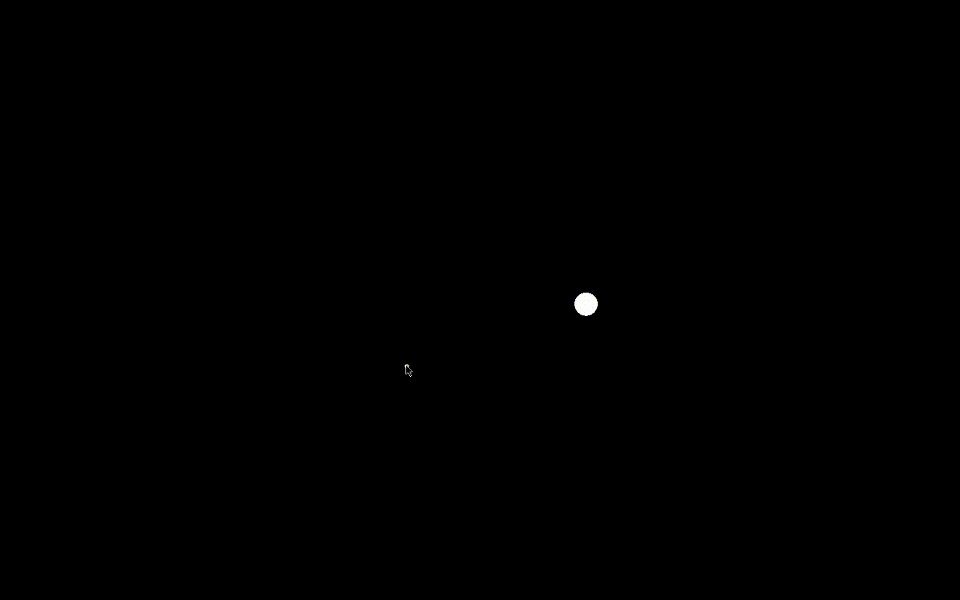
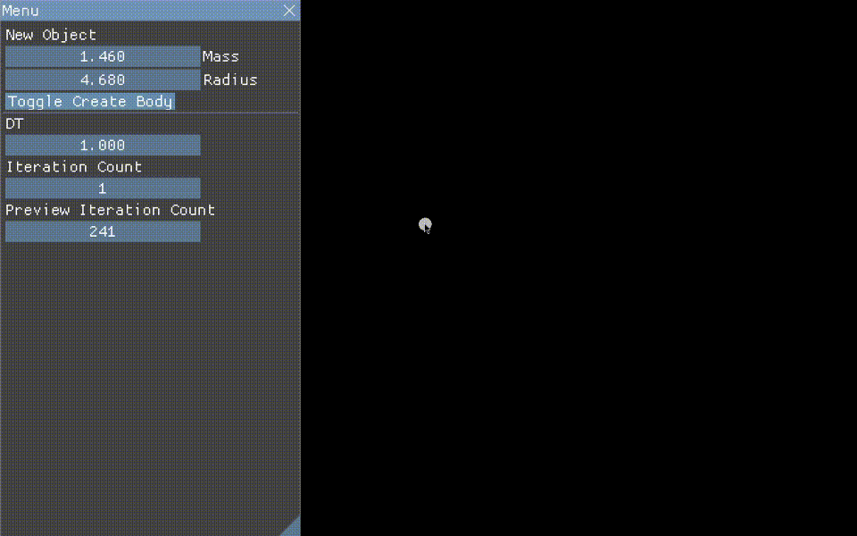

# Physics Simulators to Help Learn Physics
A set of physics simulators, one for each approximate unit of physics: mechanics, universal gravitation, electronics and magnetism, and waves

This repo is now outdated, see https://github.com/mkhan45/SIMple-Physics instead

## [physics-engine](https://github.com/mkhan45/physics-engine)
Rigidbody mechanics simulator, currently simultaneous collisions are pretty jittery

[https://github.com/mkhan45/physics-engine](https://github.com/mkhan45/physics-engine)

## [gravity-sim-v2](https://github.com/mkhan45/gravity-sim-v2)
Universal gravitation simulator using Newton's Law of Universal Gravitation

[https://github.com/mkhan45/gravity-sim-v2](https://github.com/mkhan45/gravity-sim-v2)

# Requirements

## Running:
I've put binaries for Windows and Linux in the release section of each repository and this one, eventually there will be a web version

## Building:

[rustup](https://github.com/rust-lang/rustup) - Latest stable rust toolchain

Computer

With the latest stable rust toolchain from rustup, run `cargo run --release` to compile and run; compiling will probably take >10 minutes the first time because of all the dependencies.
Using [sccache](https://github.com/mozilla/sccache) will speed up compile times significantly if you compile both as you won't have to recompile most dependencies.

# Screenshots/GIFs:

## Rigidbody mechanics sim

## Universal Gravitation

